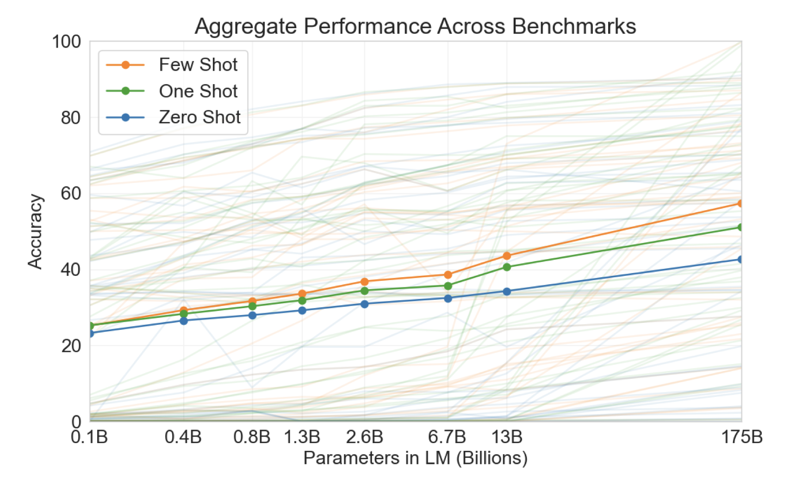

In 2020, OpenAI reported that [language models are few-shot learners](https://arxiv.org/pdf/2005.14165.pdf). This effect increases with the size of the model.

I was working with a medium-size dataset testing GPT-3.5 on a binary classification task with different numbers of in-context examples. I was working with a California housing dataset, trying to classify median housing price as greater than or less than some threshold. All features were quantitative, so I serialize them as into a simple list of the form \[feature\]: \[value\] for each feature, which seems to be best practice (see (TabLLM)[https://arxiv.org/pdf/2210.10723.pdf]). At first I was randomly selecting the set of in-context examples each time, but later I wanted to optimize for accuracy. A natural question is, How does one choose the best n examples for in-context learning? I experiment with three approaches.

**1. Max Entropy Selection**
We train a model (in this case, a logistic regression on a standard-scaled feature set) on the entire training dataset. Then, we choose the n examples that had the highest classification uncertainty. In other words, the points whose predicted classification probabilities were nearest 0.5. The idea is to choose the points nearest the decision boundary, so that the language model can better learn the decision boundary from few points. Note that the assumption that predicted probabilities closest to 0.5 are those that lie nearest to the decision boundary does not necessarily hold for other (non-linear) classifiers.

There are a few potential problems with this approach. The most obvious one is homogeneity of the selected points. Near the decision boundary, we might reasonably assume the points are much more similar to each other than if we were to do random sampling. As a consequence the model may not learn the distinguishing features of each class. Related is that there is probably a great deal of overlap in the classes, and the data is unlikely to be linearly separable for in a small feature space. The labels of points near the decision boundary may be especially noisy, and the model may not actually learn the decision boundary well.

**2. Active Learn Examples**
I try a simple active learning approach, choosing uncertain examples to label in the spirit of the previous method. First, we randomly choose one point from each class and train a model on it. We test it on the remaining data, and select the point that had the highest classification uncertainty. That point is added to the training data, and a new model is trained. Repeat until n points are in the training data.

This model suffers the same issues as the previous method because of its emphasis on the decision boundary. Though, because the boundary updates with every loop, we likely select a more heterogeneous sample. However, this approach does not make sense with so few training points. We only use two to seed the algorithm, and in my case the data consists of 8 features, so the regression is overdetermined. For few-shot testing, I was only using 8 examples, so it was necessary to seed with a small number unless I wanted the data to be mostly random sampled. This approach makes more sense when using a large n for the final model. It is a good approach, too, when annotation is costly, so you have to be selective about which labels you want to discover. It assumes that labeled data is scarce, and may be well-suited for a different type of task, but I thought I'd test it anyway.

**3. Cluster Selection**
Here we attempt to mitigate the downsides of the max entropy approach by selecting a diverse set of points. We again scale the data, then run KMeans with # clusters = n. Then choose the point nearest each centroid, and add it to the sample.

**Results**
**Results**
| Max Entropy Selection | Active Learning | Cluster Selection |
|---|---|---|
| Correct | 338 | 356 | 365 |
| Total | 498 | 500 | 499 |
| Accuracy | 0.68 | 0.71 | 0.73 |

The difference in accuracies between max entropy and cluster selection are nearly significant at 95% confidence level (two-tailed p=0.07), and the trend seems to suggest the more diverse the examples, the better for classification (max entropy selection should select the least diverse sample, cluster selection the most, with active learning somewhere in the middle). All approaches promote class balance, so we cannot suggest the results can be attributed to difference in class imbalance, though [Zhang et al.](https://arxiv.org/pdf/2211.04486.pdf) found that class imbalance did not negatively impact model performance, and in some case selecting all examples of the same class performed better than balanced samples.

It is also hard to attribute the difference in accuracies, regardless of significance, to selection approach. Active learning and cluster selection are in particular very sensitive to intialization and may produce very different samples on each iteration. Running the active learning process about a dozen times, I saw the accuracy of the result classifier range from 0.45 to 0.7. The accuracy of a particular selection process may be an artifact of fortunately drawn sample, rather than evidence of a reliable selection procedure. Still, if I had an infinite budget and had to choose one of these approaches to perform the best over a truly thorough experiment, I would select cluster selection.

Accuracy varies unpredictably across in-context samples. Even different permutations can yield dramatically different performance. There are approaches that can reliably predict better in-context samples, but they seem to mostly depend upon letting the language model tell you what works best for it, rather than using statistical intuition about what a good training set looks like. If you have the compute, one thing that seems to work consistently well is randomly selecting several different samples, testing all of them, then choosing the sample that performs the best for validation (see Zhang et al.). [Li and Qiu](https://arxiv.org/pdf/2302.13539.pdf) find that diversity-guided sampling and entropy-guided sampling perform better than random sampling, so you are probably better off trying one of the above approaches than random sampling, but your mileage may vary depending on domain.

I should lastly reinforce that my dataset was quantitative, so results may not generalize well. I've been experiment with language models quantitative tabular data for some time now. It appears that there is a strong upper-bound on performance accuracy, though a high lower-bound as well, for tasks where the features are easy to interpret. As a consequence, alterations to prompting schemes may have muted effects in tabular classification tasks compared to other benchmark NLP tasks.

Given that the effect of few-shot prompting grows as model size increases, I'm curious to see if the effect of in-context selection approaches also grows with model size. I wonder if variance in performance over permutations of examples will increase or decrease with future generation models, too. I suspect decrease. Guess we'll see.

